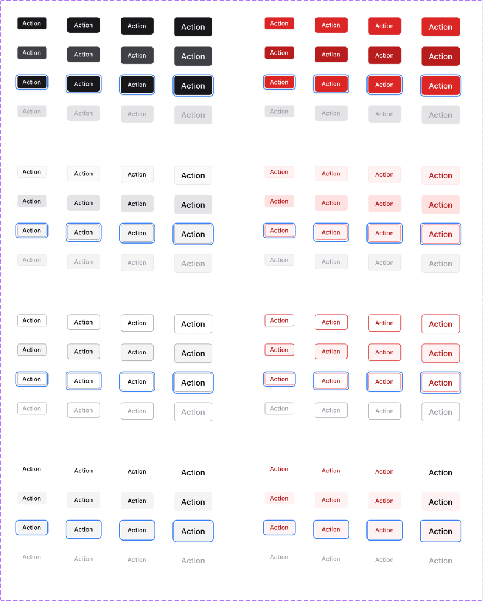

# Button

`Button` is the primary interactive element for triggering actions in the FX Design System. It supports four visual hierarchy levels, four sizes, a destructive variant, and optional leading and trailing icons — all composed through a small, predictable API.


Use `Button` anywhere the user takes an action. For navigation between pages, use [`Link`](../components/) instead.


## Preview

<figure><figcaption><p>The full <code>Button</code> matrix: the four types — <code>Primary</code>, <code>Secondary</code>, <code>Outline</code>, <code>Ghost</code> — each in default and destructive variants, across all four interactive states.</p></figcaption></figure>


Live examples are available in [Storybook](https://celigo.github.io/fuse-ui-feature/?path=/story/components-buttons-fx--text-buttons) and the matching Figma node is `16:42` in the FX Design System Library (file `9Sy3F3jd4vEW58w1tC2FTu`).


## Usage

```tsx
import { Button } from '@celigo/fuse-ui';

export function Example() {
  return (
    <Button size="md" type="Primary">
      Save changes
    </Button>
  );
}
```

## Examples

### Primary action

The highest-emphasis button. Use **exactly one** per page section to represent the single most important action.

```tsx
<Button size="md" type="Primary">Save changes</Button>
```

### Secondary with leading icon

Paired with a Primary. Icons are only added when they clarify the action — never decoratively.

```tsx
import { DownloadIcon } from '@celigo/fuse-ui/icons';

<Button size="md" type="Secondary" iconLeft IconLeft={<DownloadIcon />}>
  Export
</Button>
```

### Destructive primary

Signals an irreversible action (delete, revoke, remove). Always pair with a confirmation dialog — color alone is not sufficient.

```tsx
<Button size="md" type="Primary" destructive>
  Delete integration
</Button>
```

### Disabled outline

Use the HTML `disabled` attribute, not just the visual state — so the button is removed from the tab order and announced correctly by screen readers.

```tsx
<Button size="sm" type="Outline" disabled>
  Submit
</Button>
```

### Ghost, inline

Low-priority actions in a toolbar or data cell.

```tsx
<Button size="xs" type="Ghost">Rename</Button>
```

## Variants & states

`Button` combines four dimensions into its full variant matrix:

| Dimension | Options |
| - | - |
| `type` | `Primary` · `Secondary` · `Outline` · `Ghost` |
| `size` | `xs` · `sm` · `md` · `lg` |
| `state` | `Default` · `Hover` · `Focused` · `Disabled` |
| `destructive` | `true` · `false` |

### Types

| Type | When to use |
| - | - |
| `Primary` | High-emphasis filled button — dark fill, white label. Reserve for the single most important action. |
| `Secondary` | Medium-emphasis — light grey fill. Pair with a Primary for related actions. |
| `Outline` | Border-only — transparent fill. Use for tertiary actions. |
| `Ghost` | Text-only — no fill, no border. Use for low-priority or inline actions. |

### States

| State | Description |
| - | - |
| `Default` | Resting state |
| `Hover` | Cursor over button — slight tonal shift |
| `Focused` | Keyboard focus — blue focus ring |
| `Disabled` | Non-interactive — muted colors, `cursor-not-allowed` |

## Props / API

| Prop | Type | Default | Description |
| - | - | - | - |
| `type` | `"Primary" \| "Secondary" \| "Outline" \| "Ghost"` | `"Primary"` | Visual hierarchy level |
| `size` | `"xs" \| "sm" \| "md" \| "lg"` | `"md"` | Button height and padding scale |
| `state` | `"Default" \| "Hover" \| "Focused" \| "Disabled"` | `"Default"` | Interactive state |
| `destructive` | `boolean` | `false` | Applies destructive (red) color treatment |
| `iconLeft` | `boolean` | `false` | Shows a leading icon slot |
| `iconRight` | `boolean` | `false` | Shows a trailing icon slot |
| `IconLeft` | `ReactNode` | — | Icon component to render in the leading slot |
| `IconRight` | `ReactNode` | — | Icon component to render in the trailing slot |
| `label` | `string` | — | Button label text |
| `className` | `string` | — | Optional additional class names |
| `disabled` | `boolean` | `false` | HTML `disabled` attribute — also sets `state="Disabled"` visually |

## Design tokens

`Button` consumes the following tokens. To theme a button consistently across light/dark, update the token — not the component.

| Token | Value | Used for |
| - | - | - |
| `bg/component/highlight` | `#18181b` | Primary fill (Default) |
| `bg/component/highlight-hover` | `#3f3f46` | Primary fill (Hover) |
| `bg/component/secondary-hover` | `#e4e4e7` | Secondary fill (Hover) |
| `bg/semantic/error-strong` | `#dc2626` | Destructive fill |
| `bg/surface/disabled` | `#e4e4e7` | Disabled background |
| `text/default/disabled` | `#a1a1aa` | Disabled label color |
| `border/semantic/focusRing` | `#3b82f6` | Keyboard focus ring |
| `Radius/radius-button` | `6px` | Border radius (all sizes) |
| `Size/size-button-sm` | `36px` | Height at `sm` size |
| `Size/size-button-md` | `40px` | Height at `md` size |
| `Size/size-button-lg` | `44px` | Height at `lg` size |
| `Shadows/sm` | — | Default shadow |
| `Shadows/sm-strong` | — | Elevated shadow (Primary) |

## Usage guidelines

### Do

* Use **one** Primary button per page section — it should represent the single most important action.
* Pair a Primary with Secondary or Outline for related but lower-priority actions.
* Set `destructive` for irreversible operations (delete, revoke, remove) so danger is visually obvious.
* Match button size to surrounding UI density: `lg` for hero CTAs, `sm` / `xs` for toolbars and inline actions.
* Include an icon only when it adds clarity (e.g. a download arrow on "Export").

### Don't

* Don't use more than one Primary button in the same visual group — it creates ambiguity.
* Don't use Ghost buttons for primary actions — they're too low-emphasis to draw attention.
* Don't disable a button without explaining why (tooltip or nearby helper text).
* Don't mix sizes within a single button group — keep them consistent.
* Don't use buttons for navigation between pages — use `Link`.
* Don't truncate the label — shorten the text instead.

## Accessibility

* **Role.** Renders as a native `<button>` — no extra ARIA role needed.
* **Focus ring.** All interactive states include a visible focus ring on keyboard focus (`border/semantic/focusRing`). **Do not suppress it.**
* **Disabled state.** Use the HTML `disabled` attribute — not just visual styling — so the button is removed from the tab order and announced as disabled.
* **Destructive actions.** Pair `destructive=true` with a confirmation dialog. Color alone is not sufficient to communicate danger.
* **Icon-only.** If you use `iconLeft` / `iconRight` without a visible label, always supply an `aria-label`.
* **Contrast.** Primary (#18181b on white) meets AA (>4.5:1). Disabled text is intentionally low-contrast — don't use disabled to hide unavailable actions; surface the reason instead.
* **Touch target.** `md` (40 px) meets the 40 px minimum. Use `lg` (44 px) in touch-primary contexts.
* **Reduced motion.** No animation — no special handling needed.

## Related components

| Component | Relationship |
| - | - |
| **Icon Button** | Icon-only variant — same type/size/state matrix, no text label |
| **Close Button** | Specialised dismiss button — always renders an X icon |
| **Link** | Use instead of Ghost Button when the action navigates to another page |
| **Progress Indicator** | Use in multi-step flows where a button triggers the next step |

***


Live playground: [Button — Storybook](https://celigo.github.io/fuse-ui-feature/?path=/story/components-buttons-fx--text-buttons)

